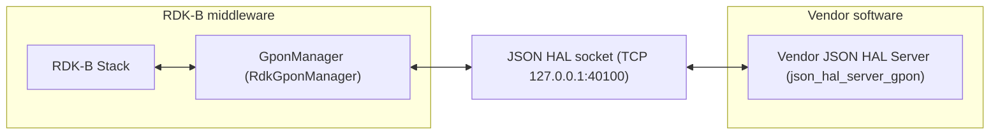

# RdkGponManager

`RdkGponManager` is the RDK-B middleware component that owns Gigabit-capable Passive Optical Network
(`GPON`) state on a fibre gateway. It presents the Optical Network Termination (`ONT`) to the rest of
RDK-B as a `TR-181` data-model surface under `Device.X_RDK_ONT`, and translates reads and writes on
that surface into requests on a `JSON` HAL that a vendor implements.

The `GPON` HAL differs structurally from most RDK-B HALs: it is **not** a C header, and no library is
linked across the HAL boundary. The contract is a `JSON` Schema, and the two participants are
separate processes exchanging messages over a `TCP` socket. That is why the workspace carries no
`rdkb-halif-gpon` repository — the interface contract lives here, beside the manager that speaks it
[superproject `README.md:27`]. Everything else in this repository is the manager middleware around
that contract.

## Documentation

This page is the repository landing page. The HAL contract itself is specified separately, and those
documents are the authority for it:

| Document | What it covers |
| --- | --- |
| [`docs/pages/halSpec.md`](docs/pages/halSpec.md) | The `GPON` `JSON` HAL interface specification — architecture, initialization and startup, threading, process and memory models, blocking behaviour, error handling, the non-functional requirements, and the complete action and object surface. |
| [`docs/pages/halSpecDetailed.md`](docs/pages/halSpecDetailed.md) | The per-parameter reference — every `TR-181` parameter with its type, constraint, access and description, plus the object index, the enumeration appendix, worked message examples and the known contract defects. |
| [`CHANGELOG.md`](CHANGELOG.md) | Release history, and the distinction between the repository release tag and the HAL schema version. |

The documentation is generated by `docs/generate_docs.sh`, which clones the `rdkcentral/hal-doxygen`
generator at tag `1.2.0` into `docs/build` and writes HTML into `docs/output/html`. Both of those
directories are excluded from version control [`docs/.gitignore`] and the generated site is published
nowhere, so the Markdown sources above are the files to read. Alongside them, `docs/pages/` carries
five symlinks — `CHANGELOG.md`, `CONTRIBUTING.md`, `COPYING.md`, `LICENSE.md` and `NOTICE.md` — that
point at the corresponding files in the repository root so the generator renders them beside the
specification.

**A note on sourcing.** Every factual claim on this page about a path, a port, a compile flag or a
component boundary names the file that establishes it, and where this repository establishes nothing
the text says so rather than filling the gap. `GPON` is not available on the `HUB6` or `XER10`
reference platforms [superproject `README.md:102-103`], so nothing here is presented as observed
runtime behaviour.

## Architecture

[`docs/pages/halSpec.md`](docs/pages/halSpec.md) is the authority for this architecture; the chain is
reproduced here only so its shape is visible at a glance. The manager is the **client** of the
interface and the vendor supplies the **server** [`source/TR-181/middle_layer_src/gponmgr_dml_hal.c`].
No separate middleware service sits between the RDK-B stack and this interface — the superproject
inventory records `GPON` as having no service dependency [superproject `README.md:102`] — because
this manager is itself the owning service. The loopback address is fixed by the transport, which
defines `SERVER_HOST` as `127.0.0.1`
[[`tcp_client.h:33`](https://github.com/rdkcentral/json-hal-library/blob/86a0a300b976f8e3295064af8fb3fd1c793c9e64/tcp_client.h)].

## JSON HAL contract

**Module identity.** Messages carry the module name `gponhal` and the schema version `0.0.1`, both
fixed as constants in the schema [`definitions.moduleName.const` and
`definitions.schemaVersion.const`, identical in both shipped schemas]. The schema's own description
of that version states that the value must not be modified and that HAL operation cannot be
performed without the correct supported version, so the client and the vendor server must agree on
it.

**Object tree.** Every parameter sits under the `TR-181` vendor extension `Device.X_RDK_ONT`, across
seven segments — `PhysicalMedia` (36 parameters), `Gem` (18), `Veip` (13), `Ploam` (10), `Gtc` (8),
`Omci` (3) and `TR69` (2), for a total of 90 in `hal_schema/gpon_hal_schema.json`. The segment names
are corroborated by the `GPON_QUERY_*` definitions the manager uses to address them
[`source/TR-181/middle_layer_src/gponmgr_dml_hal.c:64-70`], and
[`docs/pages/halSpecDetailed.md`](docs/pages/halSpecDetailed.md) documents each parameter within them.

**Actions.** The `action` enumeration carries eleven members [`definitions.action`], of which eight
bind a payload. `docs/pages/halSpec.md` names them all and records which are unsupported under the
shipped schema.

**Shipped schema variants.** Two schemas are shipped, and a build loads exactly one of them:

| Schema | Parameter definitions | Loaded when |
| --- | --- | --- |
| [`hal_schema/gpon_hal_schema.json`](hal_schema/gpon_hal_schema.json) | 90 | `WAN_MANAGER_UNIFICATION_ENABLED` is not defined |
| [`hal_schema/gpon_wan_unify_hal_schema.json`](hal_schema/gpon_wan_unify_hal_schema.json) | 95 | `WAN_MANAGER_UNIFICATION_ENABLED` is defined |

The parameter surface is purely additive: the variant carries the same 90 parameter definitions plus
five `PhysicalMedia` parameters — `Alias`, `Enable`, `LastChange`, `LowerLayers` and `Upstream` — and
every parameter, object and enumeration definition the two files share is identical. **The scoping
lists are not identical, and that is where the variant changes behaviour.** `setParameterSupportedList`
grows from 8 members to 11, adding `PhysicalMedia.{i}.Enable`, `PhysicalMedia.{i}.Alias` and
`PhysicalMedia.{i}.LowerLayers`, so the variant is writable where the default schema is read-only;
`getParameterSupportedList` grows from 95 references to 100 for the same reason.
[`docs/pages/halSpecDetailed.md`](docs/pages/halSpecDetailed.md) marks each variant-only parameter in
place and states the writable surface for both files.

**Transport.** The interface is carried by the `json-hal-library` client and server, which the middle
layer links as `-ljson_hal_client` [`source/TR-181/middle_layer_src/Makefile.am:39`]. That library is
the authority for the message envelope and the client semantics, which neither this page nor the HAL
specification restates:
[rdkcentral/json-hal-library@`86a0a300`](https://github.com/rdkcentral/json-hal-library/tree/86a0a300b976f8e3295064af8fb3fd1c793c9e64).

## Build-time variant selection

Which contract a build loads is decided in **two** steps. The compile flag alone does not determine
it, and a reader told only about the flag cannot tell which schema their build speaks.

**Step 1 — the compile flag selects a configuration file.**
`#if defined(WAN_MANAGER_UNIFICATION_ENABLED)` sets `GPON_MANAGER_CONF_FILE` to
`/etc/rdk/conf/gpon_manager_wan_unify_conf.json`, and otherwise to
`/etc/rdk/conf/gpon_manager_conf.json`
[`source/TR-181/middle_layer_src/gponmgr_dml_hal.c:57-61`]. That path is what the manager passes to
`json_hal_client_init` [same file, `:111`].

**Step 2 — the selected configuration file names the schema and the port.**
[`config/gpon_manager_conf.json`](config/gpon_manager_conf.json) names
`/etc/rdk/schemas/gpon_hal_schema.json`, and
[`config/gpon_manager_wan_unify_conf.json`](config/gpon_manager_wan_unify_conf.json) names
`/etc/rdk/schemas/gpon_wan_unify_hal_schema.json`. **Both name server port `40100`** — the variant
changes the schema, not the port. The `config/` directory holds these two files; the paths above are
where the manager reads them at runtime.

One further step completes the chain: the client reads the module name and the schema version out of
the schema file it was pointed at rather than out of the configuration file
[[`json_hal_load_config`](https://github.com/rdkcentral/json-hal-library/blob/86a0a300b976f8e3295064af8fb3fd1c793c9e64/json_hal_common.c)].
Selecting the variant therefore also fixes the module identity that travels on the wire.

## Repository layout

| Path | Contents |
| --- | --- |
| `hal_schema/` | The two `JSON` Schema contracts and eight `example_*_msg.json` message fixtures. |
| `config/` | [`RdkGponManager.xml`](config/RdkGponManager.xml), the `TR-181` data-model description, and the two client configuration files. |
| `source/GponManager/` | The service host — process entry point, message-bus interface, controller, and the manager's own link state machine (internal middleware state, not part of the HAL contract). |
| `source/TR-181/` | [`include/gpon_apis.h`](source/TR-181/include/gpon_apis.h) and `middle_layer_src/`, the data-model middle layer that translates `TR-181` access into `JSON` HAL requests. |
| `cfg/` | Autotools support directory, named by `AC_CONFIG_AUX_DIR` and `AC_CONFIG_MACRO_DIR`. |
| `docs/` | The documentation described above. |

## Building

The component builds with Autotools. `configure.ac` declares the package `RdkGponManager-rdkb`,
initialises Automake and Libtool, and generates the makefiles for `source/` and its subdirectories;
the root [`Makefile.am`](Makefile.am) declares `SUBDIRS = source`.

**Build options.** One is exposed: `--enable-notify` adds `-DENABLE_SD_NOTIFY` and links `-lsystemd`
for systemd readiness notification [`configure.ac:63-73`]. A `GITVERSION` macro records
`git describe --tags --always --dirty` into the substituted `GIT_VERSION` [`configure.ac:50-53`].

**Dependencies.** `configure.ac` checks only for standard C headers, so the makefiles rather than the
configure script declare the component's libraries: the middle layer links `-lccsp_common`,
`-lhal_platform`, `-ljson_hal_client`, `-ljson-c`, `-lpthread` and `-lsyscfg`
[`source/TR-181/middle_layer_src/Makefile.am:39`]. No other build recipe or toolchain is specified by
this repository.

**Version identities.** The `AC_INIT` string in `configure.ac` is the Autotools package identifier
rather than a release version. Release history is recorded in [`CHANGELOG.md`](CHANGELOG.md), whose
most recent tag is `v1.7.0`, and the `JSON` HAL contract carries its own version, `0.0.1`, advanced
independently of that tag.

## Contributing

Contributions are made by forking the repository and opening a pull request; RDK requires a signed
RDK Contributor License Agreement before code is accepted into the project
[[`CONTRIBUTING.md`](CONTRIBUTING.md)]. Review is routed to `@rdkcentral/wanmanager-maintainers`, the
default owner for every path in the repository [`.github/CODEOWNERS`].

## Licence

This component is licensed under the Apache License, Version 2.0. The full text is in
[`LICENSE`](LICENSE) and the attribution notices are in [`NOTICE`](NOTICE).
